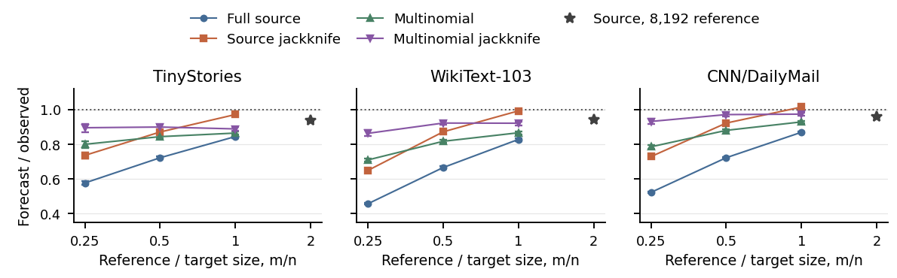

# Masked Diffusion Model Text Reconstruction

[](https://github.com/learncsai/masked-diffusion-model-text-reconstruction/actions/workflows/reproduce.yml)

Code and experiment resources for **Predicting Corpus-to-Corpus Variation in Text Reconstruction**.

How much does a masked-token prediction change when its training corpus changes? This project studies a local count-based reconstructor, forecasts its disagreement from an independent reference corpus, and compares those forecasts with small masked diffusion language models (MDLMs). Experiments use **TinyStories, WikiText-103, and CNN/DailyMail**, with squared error over GPT-2's full **50,257-token vocabulary**.

The repository unpacks and extends `finalaistats_reproducibility.zip`: statistical code, preprocessing, study configurations, training implementation, numerical evidence, and 66 training logs are directly inspectable. Paper references follow the attached submitted version, which contains **nine tables and five figures**. Publication information is maintained in [paper metadata](paper_metadata.json); the arXiv link can be added later.

## Start with the offline reproduction

Use **Python 3.14** for the exact archived analysis environment. No GPU, corpus download, or neural checkpoint is required.

```bash
git clone https://github.com/learncsai/masked-diffusion-model-text-reconstruction.git
cd masked-diffusion-model-text-reconstruction
python -m venv .venv
```

Activate the environment:

```bash
# Linux / macOS
source .venv/bin/activate
```

```powershell
# Windows PowerShell
.venv\Scripts\Activate.ps1
```

Then run:

```bash
python -m pip install -r requirements.txt
python reproduce.py
```

Open **`results/reproduction/INDEX.md`**. It links CSV/Markdown tables and PNG figures in the submitted paper's order. `results/reproduction/REPORT.json` records validation and scope. The underlying archive also regenerates analysis tables and publication figures locally. Allow several minutes and approximately 500 MB of working space.

This command recalculates results from saved measurements. Downloading corpora, constructing new forecasts, and training MDLMs are separate workflows described below. Full historical input allocations and neural weights are not distributed; a new public-data replication records its own inputs and can yield different values.

## Choose a workflow

| Goal | Guide |
|---|---|
| Rebuild the reported numerical results on CPU | [Setup and reproduction](docs/setup.md) |
| Find the inputs and generator for a particular table or figure | [Submitted-paper map](docs/paper-map.md) |
| Understand the predictors, disagreement, and corrections | [Method and metrics](docs/method.md) |
| Download, tokenize, and allocate source-disjoint inputs | [Data and preprocessing](docs/data.md) |
| Run the count studies, baselines, confirmation, smoothing, and synthetic controls | [Experiment recipes](docs/experiments.md) |
| Train the matched MDLMs and repeat neural evaluations | [Neural training](docs/training.md) |
| Inspect original measurements, training logs, and provenance | [Evidence and reproducibility scope](docs/reproducibility.md) |
| Diagnose a failed installation or rerun | [Troubleshooting](docs/troubleshooting.md) |

## What the experiments show

Corpus size affects both count noise and the strength of smoothing. Consequently, the reconstructor's disagreement can decrease much more slowly than a simple `1/n` law. Finite reference data introduces additional bias; source-split correction improves small-reference calibration, while the corrected nonlinear source bootstrap performs best in the larger-reference regime tested in the paper. Count forecasts provide some information about neural input sensitivity, but do not fully explain MDLM disagreement or its directions.



Figure 1: forecast divided by observed disagreement at `n=4096`. A ratio of one indicates calibration. Increasing reference size and applying source-split correction change the forecast substantially. The image is regenerated from the included measurements.

Stability and reconstruction quality are measured separately. The main matched comparison at `n=2048`, `q=0.5` is reproduced as Table 4:

| Corpus | Count disagreement | MDLM disagreement | Count MSE improvement | MDLM MSE improvement |
|---|---:|---:|---:|---:|
| TinyStories | 0.0223 | 0.0504 | 14.34% | 20.82% |
| WikiText-103 | 0.0308 | 0.0344 | 5.45% | 3.16% |
| CNN/DailyMail | 0.0248 | 0.0112 | 4.43% | 1.21% |

MDLM entries use 12,000 updates. Disagreement averages three A/B pairs; MSE improvement averages their six fits. These are small research models under a fixed training budget.

## Repository layout

```text
reproduce.py              Friendly entry point; submitted-paper CSV/PNG outputs
src/diffusion_lm_rmt/      Sparse counts, forecasts, corrections, MDLM implementation
scripts/                  Preparation, experiment, analysis, and validation commands
configs/                  Archived scientific settings and seeds
docs/                     Setup, paper map, data, methods, experiment recipes
artifact/                 Unpacked numerical archive and archived training code
artifact/components/      Compact study measurements and calculation scripts
artifact/training_records/ 66 training logs and recorded GPU environment
provenance/               Original hash manifest and repository adaptation record
paper/                    Python figure generator only
tests/                    Numerical and experiment-integrity checks
```

Generated results, corpus text, token arrays, checkpoints, PDFs, and TeX files are ignored by Git. The original ZIP is represented by its unpacked contents and SHA-256 provenance rather than uploaded as an opaque archive.

## Citation and publication

Upcoming
